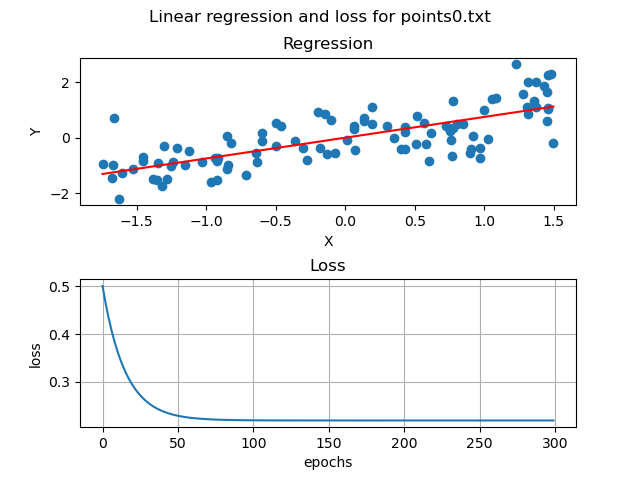
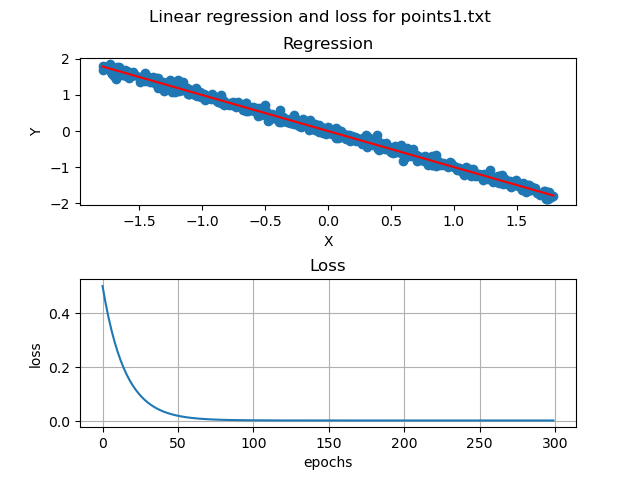
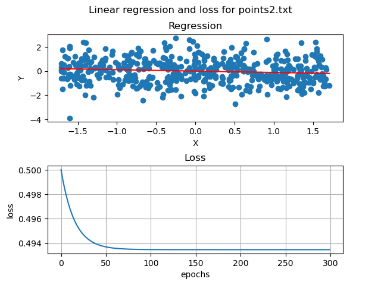
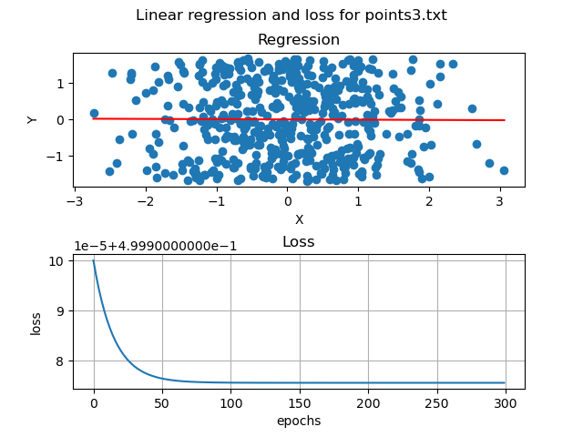
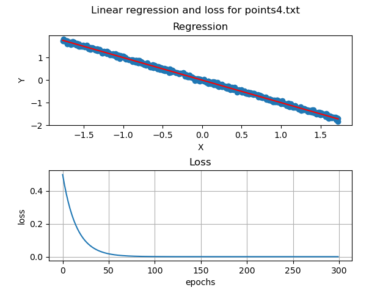
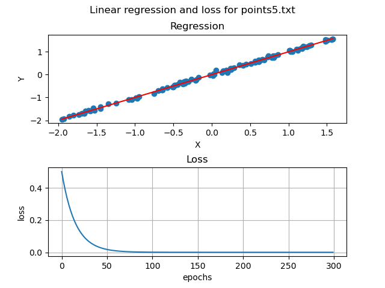

## Linear Regression (Least Mean Squares Line Fitting)

We are given a set of two dimensional datapoints in the format: (𝑥𝑖, 𝑦𝑖), the way we represent a line to be fitted to the data points is 𝑓(𝑥) = 𝜃0 + 𝜃1𝑥.  
The cost function is determined by the mean squared error formula.  

### Results:

