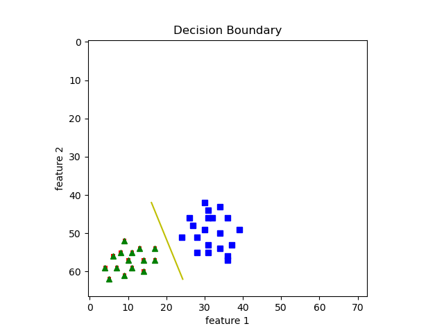
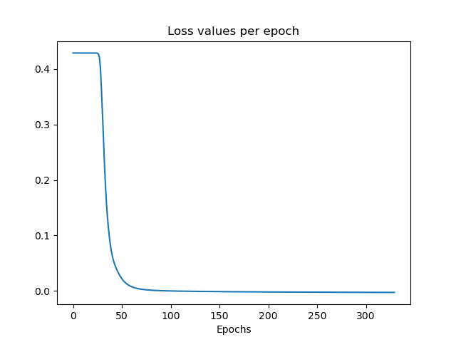
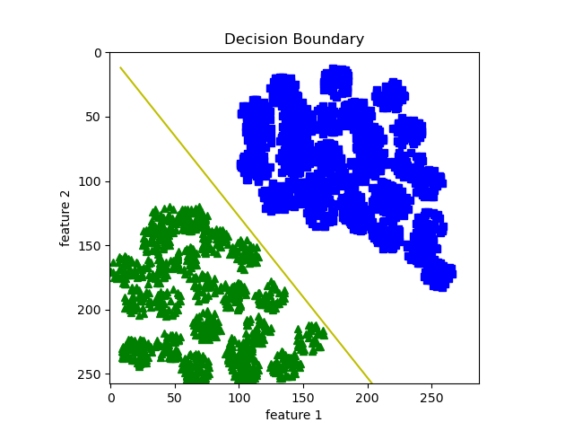
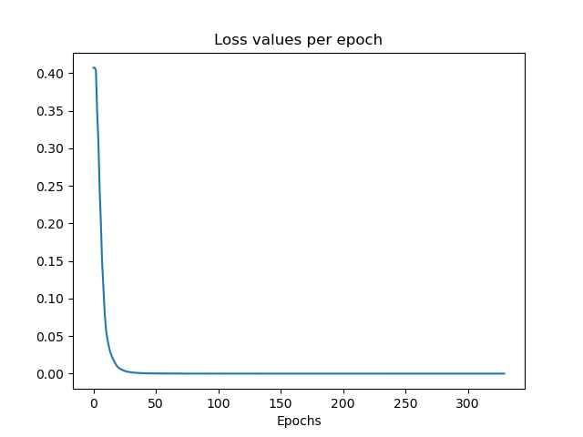

## Linear Classifiers and the Perceptron Algorithm

We use the perceptron learning algorithm for a linear classifier. We apply gradient descent and stochastic gradient descent procedure to obtain the weight vector for a two-class classification problem.

### Results:
Example 1:  

  
Example 2:  

