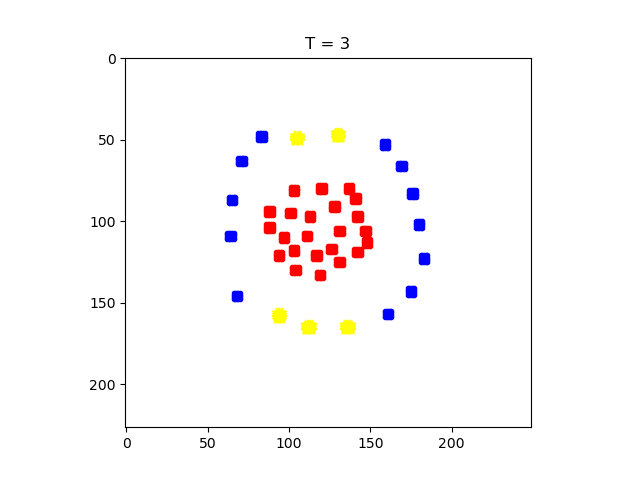
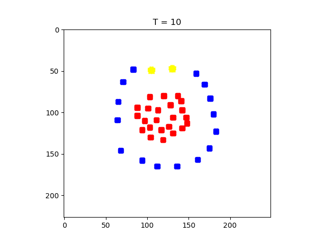
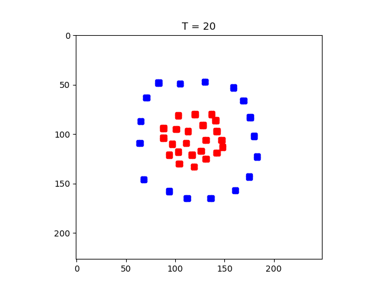
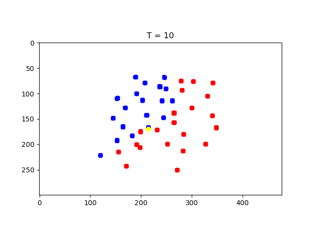

## AdaBoost

In this code we design an ensemble classifier obtained using a method called AdaBoost (Adaptive Boosting). We apply it for a binary classification problem on 2D points.

### Results:
Yellow stars represent misclassified blue points, and green stars represent misclassified red points.  

