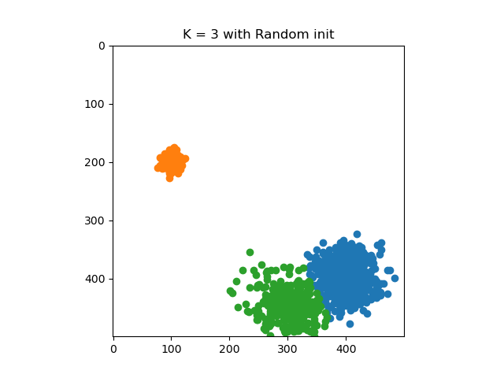
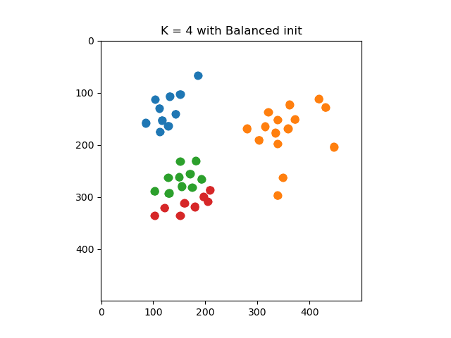
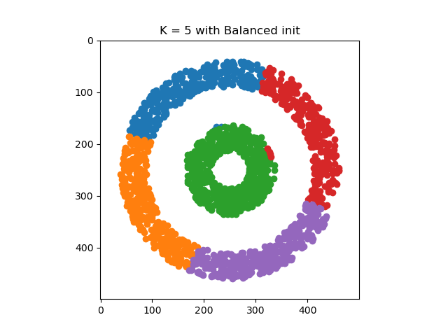

## K-means Clustering

K-means clustering is a unsupervised machine learning task that deals with the problem of grouping a set of objects in such a way that objects in the same group (called cluster) are more similar than to those in other groups.  
The K-means approach has 3 steps: Initialization, Assignment and Updating. It also presents a halting condition for the while loop.  
This code also presents a method for balanced random initialization for the k cluster centers.
### Results:

