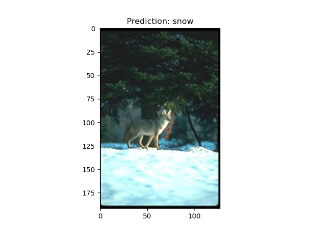
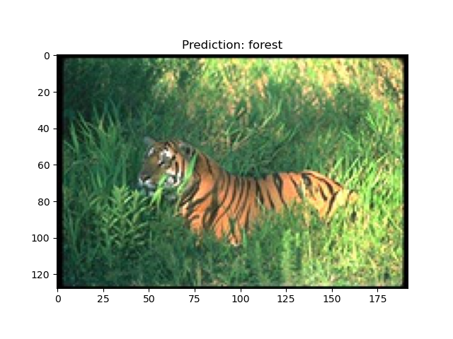
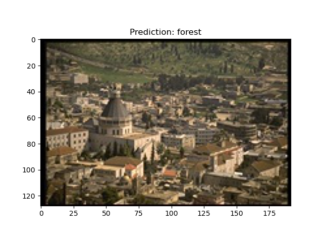
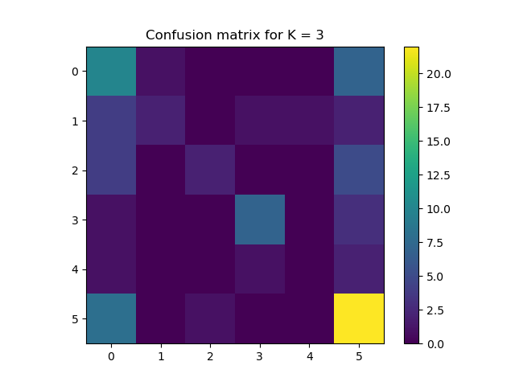
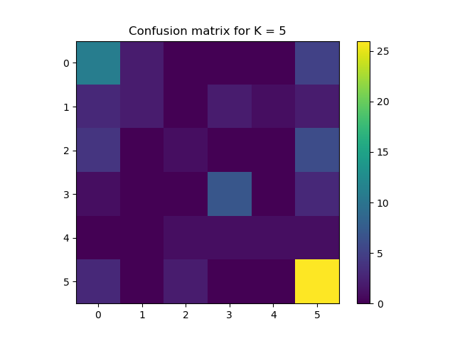

## K-Nearest Neighbor Classifier

KNN Classifier on RGB vlues of different images belonging to 6 classes.

### Results:

  
This prediction is wrong:  
  
Confusion matrices for k = 3 and k = 5.  

